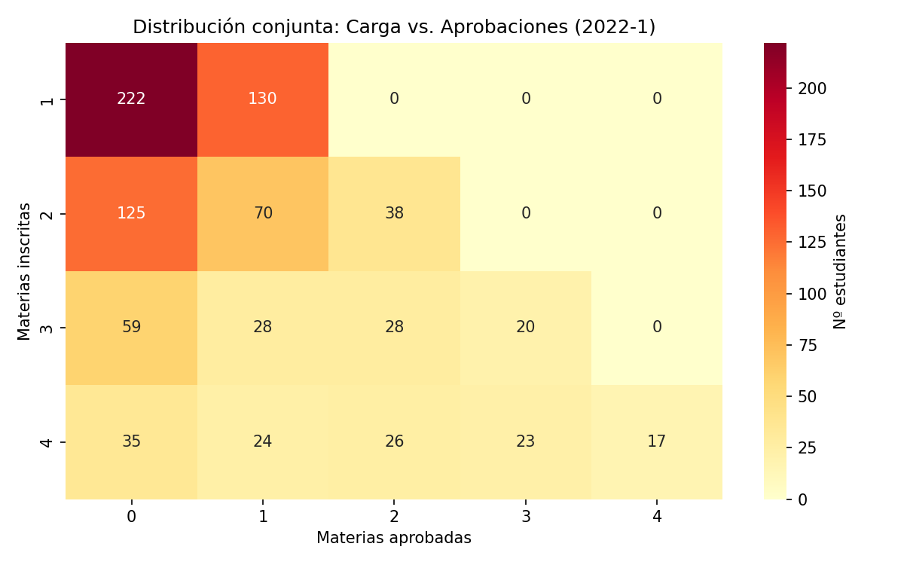
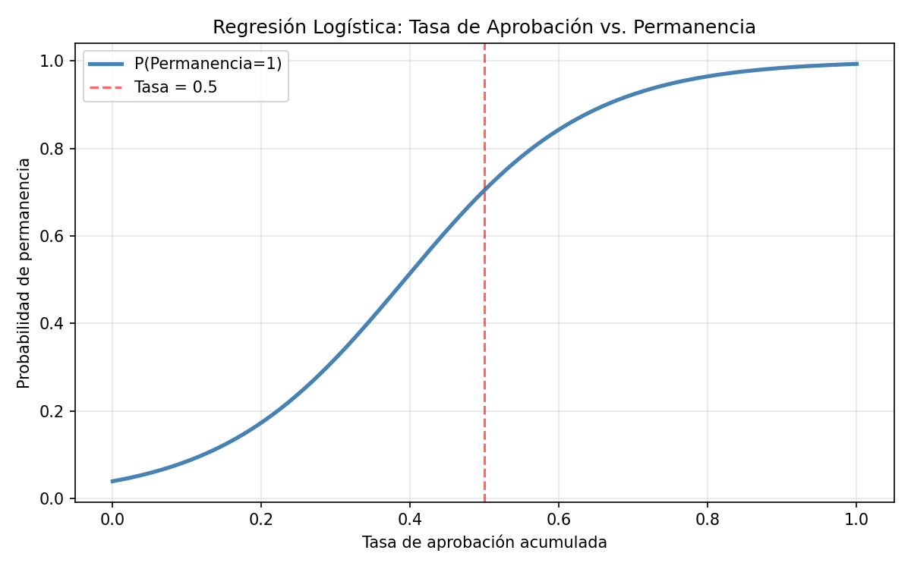
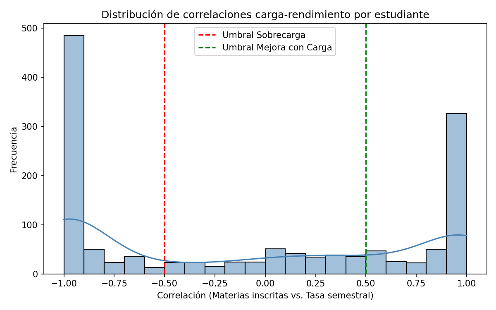

# Academic Performance, Course Load, and Student Persistence

**Longitudinal modeling of academic trajectories in engineering programs — Logistic regression applied to educational data from ITM (Instituto Tecnológico Metropolitano).**

[](https://laccei.org)
[](https://python.org)
[](https://jupyter.org)
[](https://scikit-learn.org)

---

## 📄 Publication

**Title:** *Academic Performance, Course Load, and Student Persistence: A Longitudinal Modeling of Academic Trajectories in an Engineering Program*

**Conference:** 24th LACCEI International Multi-Conference for Engineering, Education and Technology — 2026

**Status:** ✅ Accepted and presented

**Institution:** Instituto Tecnológico Metropolitano (ITM) — Medellín, Colombia

**Authors:** Ignacio Joaquín Pérez Chaves · ITM Academic Persistence Research Group

---

## Abstract

Student persistence in engineering programs represents a critical challenge for higher education institutions, particularly during the early semesters, when foundational courses exhibit high repetition and failure rates. This study examines the relationship between academic performance, academic load, and student persistence through the construction of **longitudinal academic trajectories**.

The analysis is based on institutional records of students enrolled in foundational courses (Differential Calculus, Linear Algebra, Mathematics for Computer Science, and Programming Logic) within a Software Development program between the **2022-1 and 2025-1 academic terms** (7 semesters, 3,479 students).

A synthetic cumulative performance indicator — the **course pass rate** — was developed and used as the primary predictor in a logistic regression model for student persistence. Additionally, individual-level analysis of the academic load–performance relationship enabled the identification of **differentiated student profiles**.

---

## Key Findings

| Finding | Result |
|---------|--------|
| Total students analyzed | 3,479 |
| Students in regression model | 2,153 |
| Model accuracy | **90.87%** |
| Primary predictor | Cumulative course pass rate |
| Dominant pattern | Strong positive nonlinear relationship between pass rate and persistence |

### Student Profiles by Load–Performance Response

| Profile | Total | Low Performance | Persistence Rate |
|---------|-------|----------------|-----------------|
| Overload (negative correlation) | 607 | 48 (7.9%) | 60.8% |
| Improves with Load | 463 | 121 (26.1%) | 8.0% |
| Independent | 316 | 90 (28.5%) | 38.3% |

> Key insight: Students with negative load sensitivity (Overload profile) paradoxically show lower rates of low performance — suggesting high-performing students are more structurally responsive to load changes.

---

## Methodology

```
Raw Data (7 semesters xlsx)
        │
        ▼
   ETL & Cleaning
   ├─ Remove PII (names, phone, email)
   ├─ Standardize grading structures
   └─ Merge by student ID ("Documento")
        │
        ▼
 Longitudinal Trajectory Construction
   ├─ Binary outcome: Passed=1 / Other=0
   ├─ Cumulative course pass rate per student
   └─ Binary Persistence variable
        │
        ▼
  Statistical Analysis
   ├─ Heatmaps: load × courses passed per semester
   ├─ Logistic Regression (70/30 train-test split)
   ├─ Correlation: load vs. semester pass rate (per student)
   └─ Profile classification: Overload / Improves / Independent
```

---

## Repository Structure

```
student-persistence-laccei2026/
├── notebooks/
│   ├── 01_ETL_Code.ipynb                  # Data cleaning & integration pipeline
│   ├── 02_Trayectorias_Permanencia.ipynb  # Trajectory construction & persistence variable
│   └── 03_Modelo_Analitico.ipynb          # Logistic regression + profile analysis
├── results/
│   ├── Fig1_Heatmap_2022-1.png            # Load × courses passed distribution
│   ├── Fig2_Curva_Logistica.png           # Persistence probability vs. pass rate
│   ├── Fig3_Perfiles_Correlacion.png      # Student profile distribution
│   ├── metricas_modelo.json               # Model metrics (accuracy, n, class distribution)
│   └── tabla_perfiles.csv                 # Profile summary table
├── docs/
│   ├── Paper_LACCEI-2026-FINAL.docx       # Official conference paper
│   ├── acceptance_letter.pdf              # Acceptance letter — LACCEI 2026
│   ├── participation_certificate.pdf      # Certificate of participation
│   └── Final_Exposicion.pptx             # Conference presentation slides
└── README.md
```

> ⚠️ **Data privacy:** Raw student records are not included in this repository due to institutional data privacy policies. Only anonymized results and aggregated metrics are published.

---

## Stack & Tools

| Category | Tools |
|----------|-------|
| Language | Python 3.x |
| Data processing | pandas, numpy, openpyxl |
| Machine learning | scikit-learn (LogisticRegression) |
| Visualization | matplotlib, seaborn |
| Environment | Google Colab / Jupyter Notebook |
| Statistical analysis | scipy.stats |

---

## Results

### Fig 1 — Joint distribution: Courses enrolled vs. courses passed (2022-1)


### Fig 2 — Logistic curve: Pass rate vs. probability of persistence


### Fig 3 — Student profile distribution by load–performance correlation


---

## Keywords

`Student Persistence` · `Academic Trajectories` · `Logistic Regression` · `Educational Data Mining` · `Learning Analytics` · `Higher Education` · `Academic Load` · `Longitudinal Analysis`

---

## Citation

If you use this work, please cite:

```
Pérez Chaves, I. J. (2026). Academic Performance, Course Load, and Student Persistence:
A Longitudinal Modeling of Academic Trajectories in an Engineering Program.
24th LACCEI International Multi-Conference for Engineering, Education and Technology.
Instituto Tecnológico Metropolitano, Medellín, Colombia.
```

---

## Author

**Ignacio Joaquín Pérez Chaves**
Data Science Engineering · Instituto Tecnológico Metropolitano (ITM)
Medellín, Colombia

- GitHub: [@ignacioperez1504](https://github.com/ignacioperez1504)
- Email: ignacioperezchaves@gmail.com
